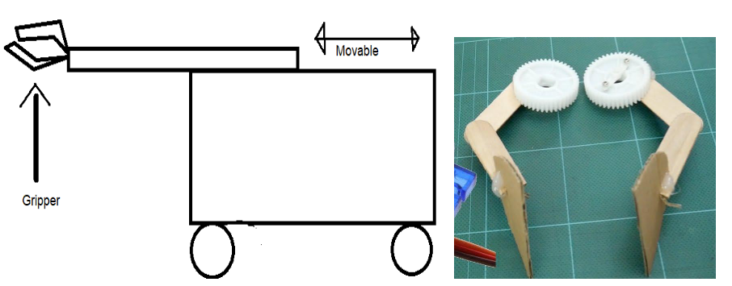

 
 
 
 
 
 

# **Training: Gazebo**
## Introduction
### Why Gazebo?
Robot simulation is an essential tool in every roboticist's toolbox. A well-designed simulator
makes it possible to rapidly test algorithms, design robots, perform regression testing, and
train AI systems using realistic scenarios. Gazebo offers the ability to accurately and
efficiently simulate populations of robots in complex indoor and outdoor environments. At
your fingertips is a robust physics engine, high-quality graphics, and convenient
programmatic and graphical interfaces.

### PRE-REQUISITES
* You should be familiar with ROS
* Ubuntu
* Basic knowledge of C++ or Python

### What will you learn?
* Making Simple models using URDF & Adding Joints
* Gazebo-ROS Integration
* Making a bot move in Gazebo
* Using XACRO files
* Using and writing Plugins
* Putting sensors on the bot
* Gmapping

### Installation Guide and tutorials:

**(If you have installed ROS desktop full then Gazebo 9 is already installed in your
system, so no need to install it again)**

Check which version of Gazebo to install depending on ROS:

http://gazebosim.org/tutorials?tut=ros_wrapper_versions&cat=connect_ros

Install Gazebo:

http://gazebosim.org/tutorials?tut=ros_installing&cat=connect_ros

### Tutorials:
#### YouTube Playlist: [link](https://youtube.com/playlist?list=PLK0b4e05LnzbHiGDGTgE_FIWpOCvndtYx)
Go through all the videos in playlist to have basic understanding of Gazebo.

**A) Making R2D2 from Star Wars using URDF: (2 Hours max)**

Follow the given links in strict order. You may also find the embedded links on the tutorial page itself, but for simplicity, we’ve given them here.
* Building a Visual Robot Model with URDF from Scratch
* Building a Movable Robot Model with URDF - ROS Wiki
* Adding Physical and Collision Properties to a URDF Model
* Using Xacro to Clean Up a URDF File - ROS Wiki
* Using a URDF in Gazebo - Introduction to ROS Control in Gazebo (This particular link is very open ended and hence optional, but if you want to explore more on ROS Control, try watching videos of ‘The Construct’ YouTube Channel)
  
**B) Making a custom Bot move autonomously: (3 Hours max)**
* https://youtu.be/H5FQm0afv-c
* https://youtu.be/H5FQm0afv-c
* https://youtu.be/sb7FoOGzb8E
C) Further tutorials for reference: (Not Compulsory): (2 Hours for doing the basics)

The following link has a plethora of tutorials covering different topics. Some of which
might be complex at this stage, so consult the mentors before doing them
http://gazebosim.org/tutorials

## Assignment

**Mobile four-wheeled robot with an extendable Gripper: (4 Hours)**

You have to make a mobile robot with four wheels. The base should have the dimensions
30cm*30cm. Wheels can be of your choice but the method of steering must be differential
drive (Unless someone is enthusiastic enough to use mecanum wheels).
The height of the bot must extend up to 20cms from the base of the bot (excluding the
wheels).

To the top of this, you’re expected to attach an extendable arm which can extend up to
10cms in front of the robot. At the end of this arm will be a simple gripper. This gripper must
be capable of opening and closing to adjust the distance between the endpoints.
In the front, also include a camera which takes continuous video.
Rough side view:

The gripper has to be a very simple one and you need to be able to control the wheels, the
linear motion of the arm plus the two fingers of the gripper independently. This needs to be
done in two way:
* > Using keyboard buttons
* > Using a script which when run, makes the robot perform the following task:
* Move front 5 meters (Ensure the arm is retracted)
* Move-in a  circle of radius 4m, clockwise.
* Extend the arm by 8cm precise. Open the gripper.
* Save the onboard camera feed of this whole mission as an mp4 file.

