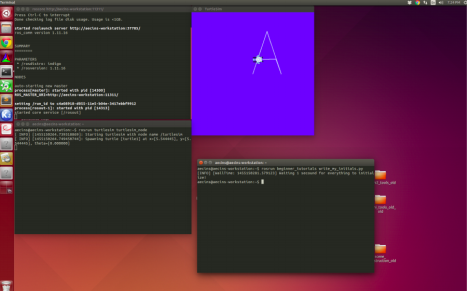

 
 
 
 
 
 

# **Training: ROS**
## Introduction

### 1) So first of all **What is a Robot?**
    A robot is any system that can perceive the environment that is its surroundings, take decisions based on the state of the environment, and is able to execute the instructions generated.
### 2) Robot Operating System or simply ROS
    ROS is a framework that is used by hundreds of Companies and techies of various fields all across the globe in the field of Robotics and Automation. It provides a painless entry point for nonprofessionals in the field of programming Robots.
### 3) OS and ROS?
    An Operating system is a software that provides an interface between the applications and the hardware. It deals with the allocation of resources such as memory, processor time, etc. by using scheduling algorithms and keeps records of the authority of different users, thus providing a security layer. It almost always has a low-level program called the kernel that helps in interfacing with the hardware and is essentially the most important part of any operating system.

**ROS** is not an operating system but a meta operating system meaning that it assumes there is an underlying operating system that will assist it in carrying out its tasks.

### 4)What are **RVIZ** and **Gazebo**?
    RVIZ is a 3D Visualization tool for ROS. It is one of the most popular tools for visualization. It takes in a topic as input and visualizes that based on the message type being published. It lets us see the environment from the perspective of the robot. Once we have all the code ready and running, we need to test our code so that we can make changes if necessary. Doing this on a real robot will be costly and may lead to a wastage of time in setting up the robot every time. Hence we use robotic simulations for that. The most popular simulator to work with ROS is Gazebo. It has good community support, it is open source and it is easier to deploy robots on it.

### 5) Why should I use ROS?
    ROS provides functionality for hardware abstraction, device drivers, communication between processes over multiple machines, tools for testing and visualization, and much more. The key feature of ROS is the way the software is run and the way it communicates, allowing you to design complex software without knowing how certain hardware works. ROS provides a way to connect a network of processes (nodes) with a central hub. Nodes can be run on multiple devices, and they connect to that hub in various ways.

# Prerequisites for using ROS:

**You should be confident in at least C++ or Python**

**Apart from this, there is no pre-req, everything is mostly explained in the tutorials**

## Installation Guide and tutorials:
* Installation guide for ROS Noetic: [Link](http://wiki.ros.org/noetic/Installation/Ubuntu)
* Tutorial for ROS: [Link](http://wiki.ros.org/ROS/Tutorials)
* Youtube Playlist: [Link](https://youtube.com/playlist?list=PLE-BQwvVGf8HOvwXPgtDfWoxd4Cc6ghiP)
  * Go through the first video of playlist to understand ROS properly, rest you can skip for now.
* Youtube Videos: [Video 1](https://youtu.be/wOlfT8GUcCk), [Video 2](https://youtu.be/GxpS18INc9s)

You are supposed to do Core ROS tutorials **1.1** - Beginner Level

*Start with* Installing and Configuring Your ROS Environment - 1

*And end with* Examining the Simple Publisher and Subscriber - 13

Some additional tutorial apart from 1-13
1) 17-18 from the same subsection - Regarding data from Bag Files
2) For defining custom messages - ROS/Tutorials/DefiningCustomMessages - ROS

**You can use Videos for better visual understanding of all the topics**
  

Also, you should write codes yourself on the terminal, rather than just reading them or copy-pasting them and see the results for yourself.
Anyways ROS has a massive community if you face any error comes during installation search that on Google, the solution will be available there!

**ROS is available for both python and C++** At the end of this tutorial,
You should have a basic knowledge of ROS packages, Rviz, Bagfiles, Subscriber/Publisher in C++/Python(At Least one).

## ROS Assignment

Please go through the material provided. Don’t attempt the assignments unless you are
done with the tutorials. All the best
1. Create a node called my_convertor using python that publishes as well as subscribes data at the same time.

    It should subscribe to topic1 which has a custom message type of
quaternions(x,y,z,w). The node processes the subscribed data and converts it into Euler angles. Refer [this](https://en.wikipedia.org/wiki/Conversion_between_quaternions_and_Euler_angles) link to know more about quaternions and Euler angles. It publishes it to topic2 which has a custom message type consisting of roll pitch and
yaw values.

    Push both the custom message files and the python file to the repo.

1. Write a TurtleSim class in python with all the functionality required to controll TurtleBot, and use that to controll the turtlesim and make it  write the first letter of your name. The output of turtlesim should be similar to the one shown in the figure. If the first letter of your name has curved parts (i.e. an ”O“) you can approximate them with right angles.

    

    Push the python file and also the screenshot of your entire screen to the repo.

