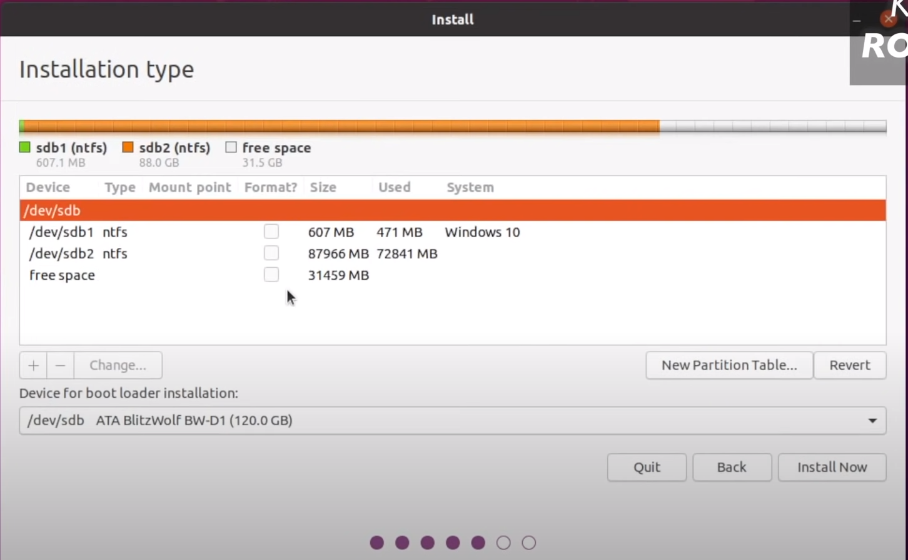

 
 
 
 
 
 

# **Ubuntu Installation Guide :**

## **Ubuntu 20.04 LTS Installation with Dual Boot with Windows :**
Ubuntu is an essential OS which is used in most of the work related to robotics and
simulations. So installing it alongside your windows is the first step to go about it.
Following are some links to guide you through the installation process. Follow each
instruction very carefully and if possible (not necessary though) keep a backup of your
laptop data. Please read the pointers before starting with any of the following links.
 
* [Ubuntu official guide](https://ubuntu.com/tutorials/install-ubuntu-desktop#1-overview)

* [How to dual boot 20.04 LTS blog on medium](https://medium.com/featurepreneur/how-to-dual-boot-ubuntu-20-04-lts-on-your-system-c39766a70bfa)
* [Ubuntu 20.04 LTS release](https://releases.ubuntu.com/focal/)
* [Youtube video on how to dual boot](https://youtu.be/-iSAyiicyQY)
  
## Read this before starting with the installation process:
* **Just read** the official guide and the blog on medium. **don't perform any** so before you begin you have a basic idea what all you need to do
* Advisable specifications for the installation which UMIC peeps use-
  * Free Space Allocation for dual boot - 100 to 150 GB, although if you're
feeling generous and plan to work in Controls/Path Planning/ML subsystem in
the long run, you can go upto 300-400 GB
  * Root Partition - 50% of allocated space is preferable
* You can download iso image from [Ubuntu 20.04 LTS release](https://releases.ubuntu.com/focal/), you are supposed to download 	*ubuntu-20.04.5-desktop-amd64.iso* 

### **You can follow the Youtube Video thoroughly**

### Issues you might face, or To DO before you get started with dual boot
* Turn off encryption
* Turn off secure boot
* Turn off Fast Boot 

 
  
if you are not able to click on the options or haven't got any options to select, although you followed all the steps thoroughly.
  [The issue you are supposed to look into](https://help.ubuntu.com/rst/)
   

  **Get in touch with some senior to get it fixed**